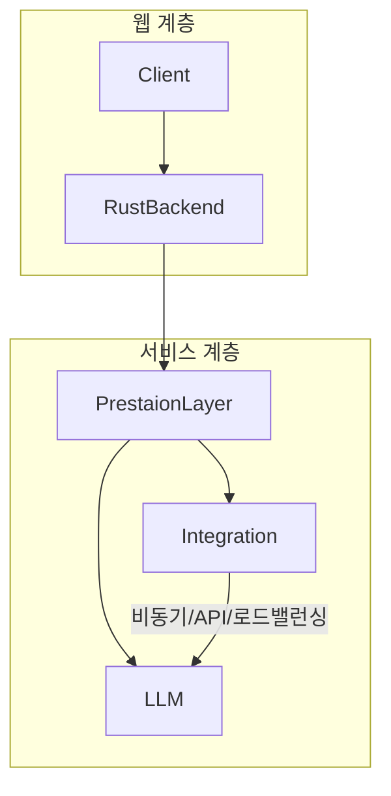

```mermaid

flowchart TD
    subgraph Web["웹 계층"]
        Client
        RustBackend
    end
    subgraph Service["서비스 계층"]
        PrestaionLayer
        Integration
        LLM
    end

    Client --> RustBackend
    RustBackend --> PrestaionLayer
    PrestaionLayer --> Integration
    PrestaionLayer --> LLM
    Integration -- 비동기/API/로드밸런싱 --> LLM


```